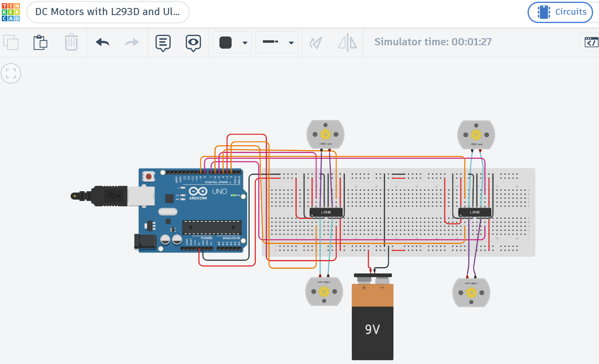

# Arduino Robotics Tasks

This repository contains two Arduino robotics projects completed as part of the Smart Methods Robotics Training

---
## Repository Structure

```text
arduino-robotics-tasks/
│
├── Task-1-DC-Motors/
│   ├── dc_motor.ino
│   ├── README.md
│   └── images/
│       └── task1.png
│
├── Task-2-Ultrasonic-Servo-LED/
│   ├── ultrasonic_servo_led.ino
│   ├── README.md
│   ├── images/
│   │   └── task2.png
│   └── demo-video.mp4
│
└── README.md
```

# Task 1 – DC Motors with L293D and Ultrasonic Sensor

## Overview
This task controls four DC motors using the L293D motor driver and integrates an ultrasonic sensor with a servo motor for obstacle detection

### 🎥 Circuit Image



### Project Link

🔗 [View Task 1 Project](https://www.tinkercad.com/things/6LxpwOf1frS-dc-motors-with-l293d-and-ultrasonic-sensor?sharecode=42FKBVbonA8jo3oXijIe6bJDcJCekRV13XAE-2yzjm8)

---

# Task 2 – Ultrasonic Sensor with Servo Motor and LED

## Overview
This task uses an HC-SR04 ultrasonic sensor to control a servo motor and an LED based on object distance

### 🎥 Demonstration Video


### Project Files

🔗 [View Task 2 Project](https://www.tinkercad.com/things/5xdj1YoJXdM-brilliant-fyyran-rottis?sharecode=kgUKZH454IbkCaSzBrEtBdosq1UJbkEoeUiT0pzzoeA)

---

## Hardware Used

- Arduino Uno
- HC-SR04 Ultrasonic Sensor
- SG90 Servo Motor
- L293D Motor Driver
- DC Motors
- LED
- Breadboard
- Jumper Wires

## Author

Aryam Aseiri
